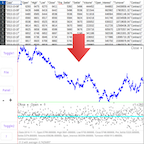

# What it is

CSV Analyser is a visualiser and analyser of data in CSV files.  It's built using Kotlin Multiplatform and runs on Android, Linux, Windows and MacOS.  It's also a demo project on how to start using Kotlin in data science projects.

# How to use it

At the start, tap on "File" button to import a csv file.

After a valid file is imported, a pulldown menu button "Column" appears on the upper-right corner.  Tap on it to select a column, and plot of the column is shown as scattered dots.

The app includes two plot areas: and upper and a lower, tied on the X-axis.  By defaults, lower plot is off.  To show it, tap on button "Toggle2".  

The lower plot will show differences of two columns.  After selecting column 1 and column 2, tap on button "c1-c2[j]" on the right side, then the differences of the two columns are shown.  The "j" is a lag index, by default is 0, you can change it by typing in a different number.  The difference with the lag is computed as c1[i] - c2[i-j].

The upper and lower plots can be toggled on and off separately.

The plots can be zoomed in and out with "+" and "-" buttons.  The charts can be dragged with a finger or mouse.  Dragging along Y-axis is independent for the two plots.  Along X-axis, it's tied.

Tap on the "?" button, a text info area will appear below the lower plot.  The area prints out related info of any point selected.

Tap on the "Panel" button will hide/show the left panel.

A test data file "test.csv" is included.

# How to get it

The project includes an APK file for Android and a Deb file for Ubuntu flavours of Linux.

For other systems, it can be built in the following ways.

Federa etc: ./gradlew packageRpm

Windows:    ./gradlew packageMsi

Mac:        ./gradlew packageDmg

# License

CSVAnalyser is provided under MIT License: https://opensource.org/licenses/MIT

# Used Libraries and their licenses

[KFilePicker](https://github.com/Tlaster/KFilePicker)

[dataframe](https://github.com/Kotlin/dataframe)

[androidx.compose](https://developer.android.com/jetpack/compose)

[Kotlin Multiplatform](https://kotlinlang.org/docs/multiplatform.html)